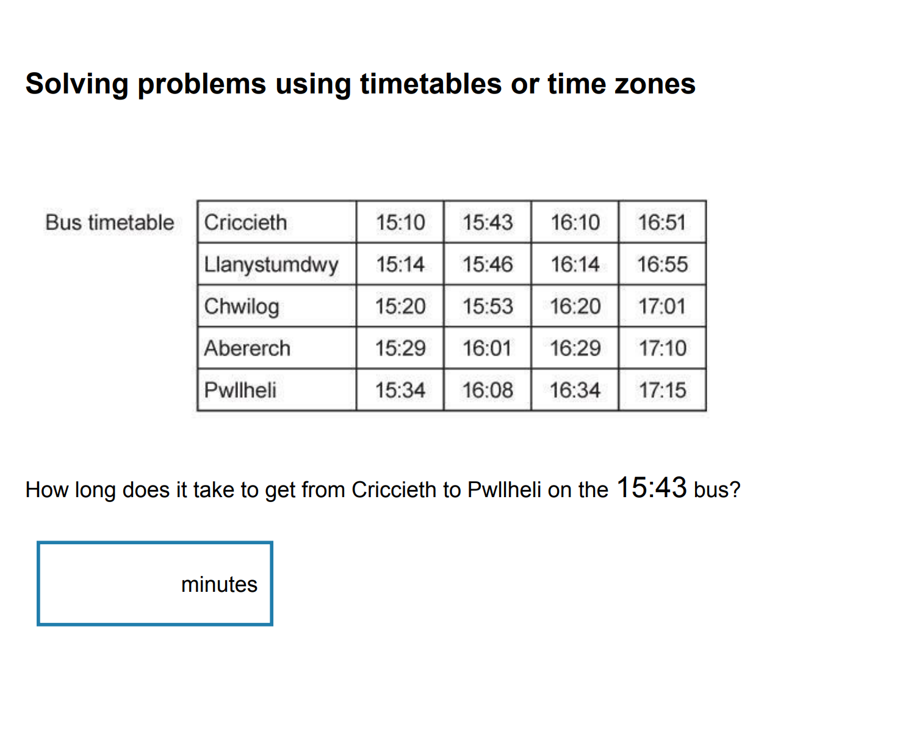
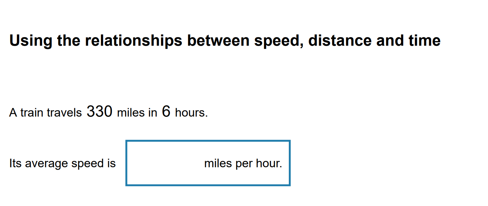
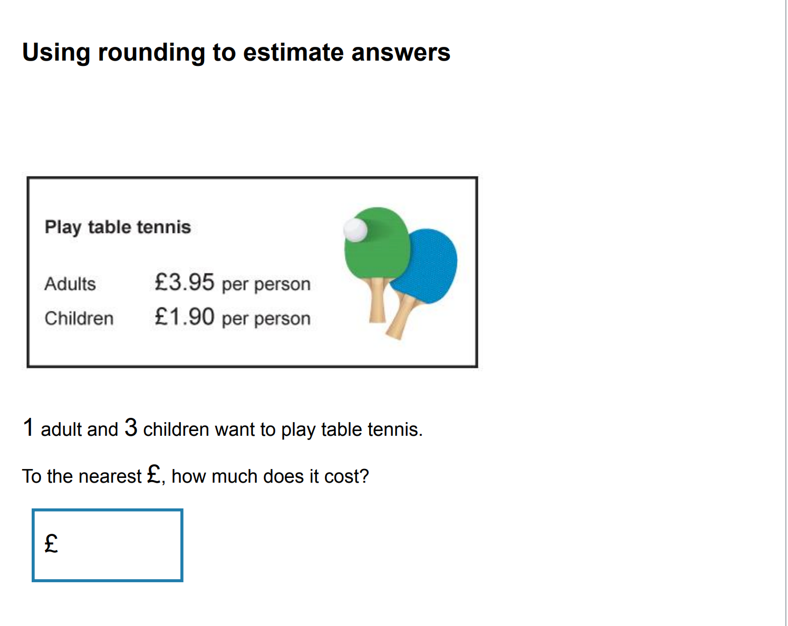
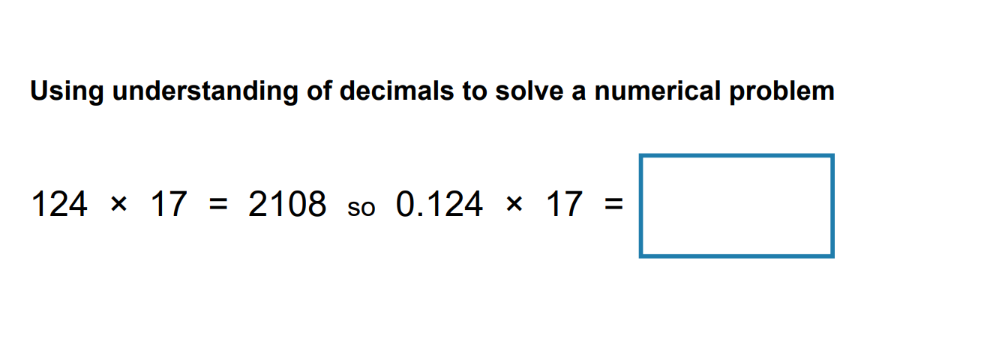
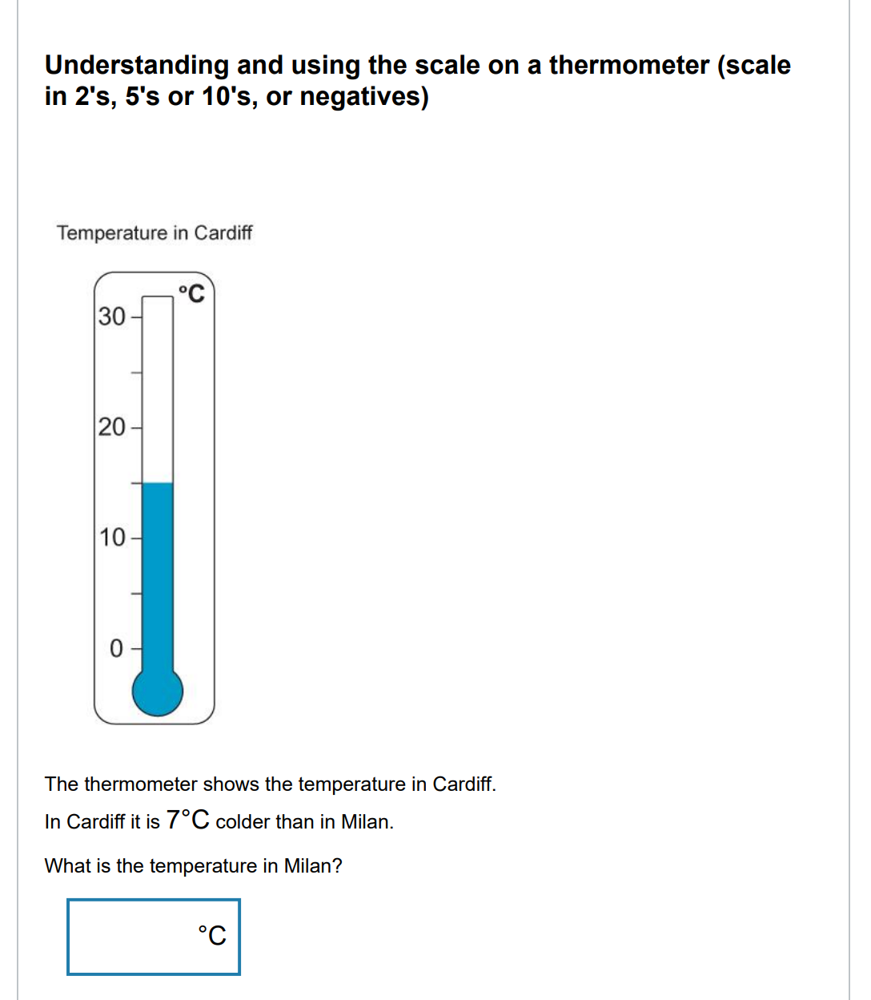
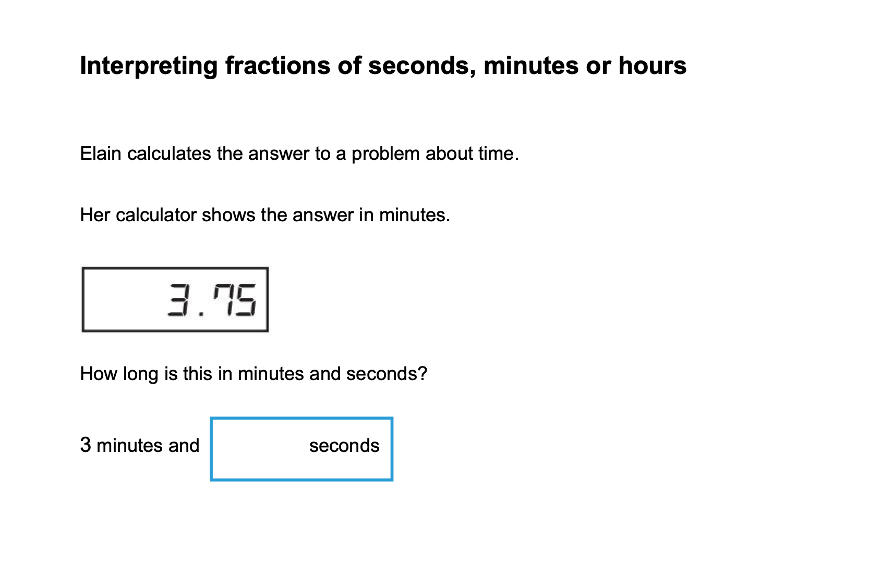
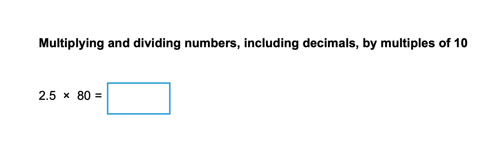

okay, so here is my idea:

I want to create a simple web application that can help my children improve their math skills on areas they struggle with.

Base on their recent assessments, they are struggling with certain areas in math. The app will provide interactive exercises, quizzes, and games that focus on these specific topics.

My elder son is struggling with the following areas:

| Area                                                         | Example                        |
| ------------------------------------------------------------ | ------------------------------ |
| solving problems using timetables or time zones              |  |
| using the relationships between speed, distance and time     |        |
| using rounding to estimate answers                           |        |
| using understanding of decimals to solve a numerical problem |        |

My younger son is struggling with the following areas:

| Area                                                                                         | Example                  |
| -------------------------------------------------------------------------------------------- | ------------------------ |
| understanding and using the scale on a thermometer (scale in 2’s, 5’s or 10’s, or negatives) |  |
| interpreting fractions of seconds, minutes or hours                                          |  |
| multiplying and dividing numbers, including decimals, by multiples of 10                     |  |
|                                                                                              |                          |

The app will have the following features:

1. **User Profiles**: Each child can have their own profile to track progress and areas of improvement.
2. **Interactive Exercises**: Tailored exercises for each area of struggle, with instant feedback.
3. **Quizzes**: Short quizzes to assess understanding and retention of concepts.
4. **Games**: Fun, engaging games that reinforce math skills in a playful manner.
5. **Progress Tracking**: Visual representation of progress over time, highlighting improvements and areas needing more focus.
6. **Parent Dashboard**: A section for parents to monitor their children's progress and receive suggestions for additional practice.
7. **Resource Library**: Access to additional resources such as videos, articles, and tips for parents to help their children with math at home.